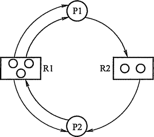

# 死锁
## 死锁的概念
多个进程在运行过程中因争夺资源而造成的一种僵局，当进程处于这种僵持状态时，若无外力作用，它们都将无法再向前推进。

## 产生死锁的原因
* 竞争资源
* 进程推进顺序非法

## 产生死锁的必要条件
1. 互斥条件：一个资源每次只能被一个进程使用。
2. 请求与保持条件：一个进程因请求资源而阻塞时，对已获得的资源保持不放。
3. 不剥夺条件:进程已获得的资源，在末使用完之前，不能强行剥夺。
4.  循环等待条件:若干进程之间形成一种头尾相接的循环等待资源关系。

## 处理死锁的基本方法
1. 预防死锁：设置某些限制条件，去破坏产生死锁的四个必要条件中的一个或几个，来预防发生死锁。
2. 避免死锁： 在资源的动态分配过程中，用某种方法去防止系统进入不安全状态，从而避免发生死锁。
3. 检测死锁： 允许系统在运行过程中发生死锁，但可通过系统所设置的检测机构，及时地检测出死锁的发生，并精确地确定与死锁有关的进程和资源。然后采取适当措施，从系统中将已发生的死锁清除掉。
4. 解除死锁：当检测到系统中已发生死锁时，须将进程从死锁状态中解脱出来。

## 预防死锁的方法
预防死锁的方法是使四个必要条件中的第2, 3, 4个条件不能成立，来避免发生死锁。由于条件1，是由设备的固有特性所决定的，不仅不能改变，还应加以保证。

1. 摒弃“请求和保持”条件：规定所有进程在开始运行之前，都必须一次性地申请其在整个运行过程所需的全部资源。 缺点是资源严重浪费，进程延迟运行。
2. 摒弃“不剥夺”条件：规定进程是逐个地提出对资源的要求的，当一个已经保持了某些资源的进程再提出新的资源请求而不能立即得到满足时，必须释放它已经保持了的所有资源，待以后需要时再重新申请。 缺点是实现复杂，可能因反复申请和释放资源，致使进程的执行被无线地延迟，增加系统开销，降低系统吞吐量。
3. 摒弃“环路等待”条件：规定系统将所有资源按类型进行线性排队，并赋予不同的序号，所有进程对资源的请求必须严格按照资源序号递增的次序提出。

## 死锁检测
### 资源分配图
用圆圈代表一个进程，用框代表一类资源。由于一种类型的资源可能有多个，用框中的一个点代表一类资源中的一个资源。从进程到资源的有向边叫请求边，表示该进程申请一个单位的该类资源；从资源到进程的边叫分配边，表示该类资源已经有一个资源被分配给了该进程。

### 死锁定理
1. 在资源分配图中，找出既不阻塞又不是孤点的进程Pi（即找出一条有向边与它相连，且该有向边对应资源的申请数量小于等于系统中已有空闲资源数量。若所有的连接该进程的边均满足上述条件，则这个进程能继续运行直至完成，然后释放它所占有的所有资源）。消去它所有的请求边和分配边，使之成为孤立的结点。
2. 进程Pi所释放的资源，可以唤醒某些因等待这些资源而阻塞的进程，原来的阻塞进程可能变为非阻塞进程。根据第1条中的方法进行一系列简化后,若能消去图中所有的边，则称该图是可完全简化的。

S为死锁的条件是当且仅当S状态的资源分配图是不可完全简化的,该条件为死锁定理。

## 死锁的解除
1. 资源剥夺法。挂起某些死锁进程，并抢占它的资源，将这些资源分配给其他的死锁进程。但应防止被挂起的进程长时间得不到资源，而处于资源匮乏的状态。
2. 撤销进程法。强制撤销部分、甚至全部死锁进程并剥夺这些进程的资源。撤销的原则可以按进程优先级和撤销进程代价的高低进行。
