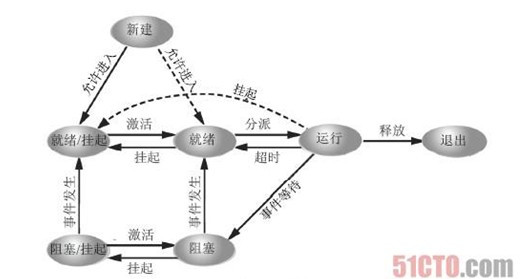
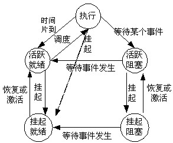

# 进程
## 进程概念的引入

程序的顺序执行：顺序性、封闭性、可再现性

程序的并发执行：间断性、失去封闭性、不可再现性
## 进程的定义
* 进程是程序的一次执行
* 进程是一个程序及其数据在处理机上顺序执行时所发生的活动
* 进程是程序在关于某数据集合上的一次运行活动，是系统进行资源分配和调度的基本单位

## 进程的特征
1. 结构特征：程序段、相关的数据段和程序控制块（PCB）三个部分构成了进程实体
2. 动态性：进程的实质是进程实体的一次执行过程，因此，动态性是进程的基本特征。动态性还表现在：“进程由创建而产生，由调度而执行，由撤销而消亡”，有一定的生命周期。而程序只是一组有序指令的集合，并存放在某种介质上，是静止的。
3. 并发性：多个进程实体同存于内存中，且能在一段时间内同时运行。而程序是不能并发执行的。
4. 独立性：进程实体是一个能独立运行、独立分配资源和独立接受调度的基本单元。
5. 异步性：进程按照各自独立的，不可预知的速度向前推进，或者说进程实体按异步方式运行。

## 进程的状态
**前3种是进程的基本状态**
1. 就绪状态：当进程已分配到除CPU以外的所有必要资源后，只要再获得CPU就可以立即执行，此时的状态称为就绪状态。
2. 执行状态：进程获得CPU，其程序正在执行
3. 阻塞状态（等待状态/封锁状态）：正在执行的进程由于发生某事件而暂时无法继续执行时，放弃处理机而处于暂停状态，此时的状态称为阻塞状态。
4. 挂起状态
5. 创建状态：创建一个进程一般需要两个步骤：首先，为新进程创建PCB，并填写必要的管理信息。其次，把进程转入就绪状态并插入到就绪队列中。当一个进程被创建时，系统为其分配的PCB，填写了相关必要信息，但是还未为其分配必须的资源或其他信息。此时的进程拥有自己的PCB，但是自身还未进入主存，进程还不能被调用运行，此时所处的状态就是创建状态。
6. 终止状态：进入终止状态的进程不能再执行，但会在操作系统中保留一个记录。其中保存状态码和一些计时统计数据，供其他进程收集，一旦其他进程完成了对终止状态进程的信息提取之后，操作系统将删除该进程。

## 进程的状态转换图




## 进程控制块（Process Control Block）
### 进程控制块的作用
+ 使一个多道程序环境下不能独立运行的程序（含数据），成为一个能独立运行的基本单元，一个能与其它进程并发执行的进程。

+ 操作系统是根据PCB来对进程进程控制和管理的

+ PCB是进程存在的惟一标志

### 进程控制块中的信息
1. **进程标识符**：进程标识符用于惟一地标识一个进程。通常有两种标识符，
    1. 内部标识符：是一个惟一的数字标识符，通常是一个进程的序号，设置内部标识符主要是为了方便系统使用。
    2. 外部标识符，由创建者提供，通常由字母、数字组成。往往是在用户（进程）访问该进程时使用。为了描述进程的家族关系，还设置父进程标识符和子进程标识符。还可设置用户标志符，指示拥有该进程的用户。
2. **处理机状态**：主要由处理机的各种寄存器中的内容组成。处理机在运行时，许多信息都放在寄存器中，当处理机被中断时，所有这些信息都必须保存在PCB中，以便在该进程重新执行时，能从断点继续执行。这些寄存器包括：
    1. 通用寄存器：用于暂存信息，用户可以访问
    2. 指令计数器：存放要访问的下一条指令的地址
    3. 程序状态字PSW：存放状态信息。如执行方式、中断屏蔽标志等。
    4. 用户栈指针：每一个进程都有一个或多个与之相关的系统栈，用于存放过程和系统调用参数及调用地址。
3. **进程调度信息**：与进程调度和进程对换有关的信息，包括：
    1. 进程状态
    2. 进程优先级
    3. 进程调度所需的其它信息，与所采用的的进程调度算法有关，例如，进程已等待CPU的时间总和。
    4. 事件，指进程由执行状态转变为阻塞状态所等待的事件，即阻塞原因。
4. **进程控制信息**：
    1. 程序和数据的地址。
    2. 进程同步和通信机制
    3. 资源清单，包括所需的除CPU以外的全部资源和已经分配到的资源列表。
    4. 链接指针：本进程（PCB）所在队列中的下一个进程的PCB的首地址。

## 进程控制
### 进程的创建
#### 引起进程创建的事件
1. 用户登录：在分时系统中，用户在终端键入登录命令后，如果是合法用户，系统为该终端建立一个进程，并把它插入就绪队列。
2. 作业调度：在批处理系统中，当作业调度程序按一定的算法调度到某作业时，便将该作业调入内存，为它分配资源，并立即为它创建进程，插入就绪队列。
3. 提供服务：当运行中的用户程序提出某种请求后，系统将为它创建一个进程来提供用户所需要的服务。
4. 应用请求：前三种事件是由系统为它创建一个新进程，而第4种是基于应用进程的需求，有它自己创建一个新进程，以便使新进程以并发运行方式完成特定任务。

#### 进程的创建过程
进程创建原语：```Create()```
1. 申请空白PCB
2. 为新进程分配资源
3. 初始化PCB
4. 将新进程插入就绪队列

### 进程的终止
#### 引起进程终止的事件
1. 正常结束
2. 异常结束：出现某种错误或故障，如：越界错误、非法指令、运行超时、等待超时、I/O故障
3. 外界干预：进程应外界的请求而终止。如：操作员或操作系统干预、父进程请求、父进程终止

#### 进程的终止过程
进程终止原语：```destroy()```
1. 根据被终止进程的标识符，从PCB集合中检索出该进程的PCB，从中读取该进程的状态。
2. 若该进程正处于执行状态，应立即终止该进程的执行，并置调度标志为真，用于指示该进程被终止后应重新进程调度。
3. 若该进程还有子孙进程，还应将其所有子孙进程予以终止，以防它们成为不可控的进程。
4. 将被终止进程所拥有的全部资源，或者归还给其父进程或者归还给系统。
5. 将被终止进程从所在队列中移出，等待其他程序来搜集信息。

### 进程的阻塞与唤醒
#### 进程的阻塞
阻塞原语：```block()```

正在执行的进程，由于期待的某些事件未发生，如请求系统资源失败、等待某种操作的完成、新数据尚未到达或无新工作做等，则由系统自动执行阻塞原语(Block)，使自己由运行状态变为阻塞状态。可见，进程的阻塞是进程自身的一种主动行为。

阻塞原语的执行过程是：
1. 找到将要被阻塞进程的标识号对应的PCB。
2. 若该进程为运行状态，则保护其现场，将其状态转为阻塞状态，停止运行。
3. 把该PCB插入到相应事件的等待队列中去。

#### 进程的唤醒
唤醒原语：```wakeup()```

当被阻塞进程所期待的事件出现时，如它所启动的I/O操作已完成或其所期待的数据已到达，则由有关进程（比如，提供数据的进程）调用唤醒原语(Wakeup)，将等待该事件的进程唤醒。

唤醒原语的执行过程是：
1. 在该事件的等待队列中找到相应进程的PCB。
2. 将其从等待队列中移出，并置其状态为就绪状态。
3. 把该PCB插入就绪队列中，等待调度程序调度。

### 进程的挂起与激活
#### 进程的挂起
挂起原语：```suspend()```

当出现了引起进程挂起的事件时，比如，用户进程请求将自己挂起，或父进程请求挂起某子进程。系统将利用挂起原语suspend()将指定进程或处于阻塞状态的进程挂起。

挂起原语的执行过程是：
1. 首先检查被挂起进程的状态,如果处于活动就绪就改为静止就绪，如果处于活动阻塞就改为静止阻塞。
2. 为便于用户或父进程考查该进程的运行情况，把该进程的PCB复制到某指定的内存区域。
3. 最后，若被挂起的进程正在执行，则转向调度程序重新调度，从而将处理机重新分配。

#### 进程的激活
激活原语：active()

当发生激活进程的事件时，例如，父进程或用户进程请求激活指定进程，若该进程驻留在外存而内存中已有足够的空间时，则可将外存上的该进程换入内存。

激活原语的激活过程：
1. 将进程从外存调入内存
2. 检查该进程的现行状态，如果是静止就绪就改为活动就绪，如果是静止阻塞就改为活动阻塞。

假如采用的是抢占调度策略，则每当有新进程进入就绪队列时，检查是否要进行重新调度，即比较被激活进程与当前进程的优先级，决定处理机归属。

## 进程同步
进程同步的主要任务是对多个相关进程在执行次序上进行协调，以使并发执行的诸进程之间能有效地共享资源和相互合作，从而使程序的执行具有可再现性。

### 临界资源
一次仅允许一个进程使用的资源称为临界资源。

### 临界区
每个进程访问临界资源的那段代码称为临界区。

### 进程同步应遵循的规则
1. 空闲让进：当无进程处于临界区时，表明临界资源处于空闲状态， 应允许一个请求进入临界区的进程立即进入自己的临界区，以有效地利用临界资源。
2. 忙则等待：当已有进程进入临界区时，表明临界资源正在被访问，因而其它试图进入临界区的进程必须等待，以保证对临界资源的互斥访问。
3. 有限等待：对要求访问的临界资源的进程，应保证在有限时间内能进入自己的临界区，以免陷入“死等”状态。
4. 让权等待：当进程不能进入自己的临界区时，应立即释放处理机以免进程陷入“忙等”状态。

### 进程同步方法
1. 临界区：在任意时刻只允许一个线程对共享资源进行访问，如果有多个线程试图访问公共资源，那么在有一个线程进入后，其他试图访问公共资源的线程将被挂起，并一直等到进入临界区的线程离开，临界区在被释放后，其他线程才可以抢占。
2. 信号量：它允许多个线程在同一时刻访问同一资源，但是需要限制在同一时刻访问此资源的最大线程数目。

    PV操作：设某资源的初始值为n。每次P操作，意味着进程请求一个单位的该类资源，n=n-1，当n<0时，表示该类资源已经分配完毕，因此进程应调用blick原语，进行自我阻塞。此时，n的绝对值表示已经阻塞的进程的数目。每次V操作，意味着执行进程释放一个单位的该类资源，n=n+1，当n<=0时，表示仍有等待该类资源的进程被阻塞，故应调用wakeup原语，唤醒一个等待进程。
3. 互斥量：采用互斥对象机制。 只有拥有互斥对象的线程才有访问公共资源的权限，因为互斥对象只有一个，所以能保证公共资源不会同时被多个线程访问。互斥不仅能实现同一应用程序的公共资源安全共享，还能实现不同应用程序的公共资源安全共享。
4. 管程：代表共享资源的数据结构，以及由对该共享数据结构实施操作的一组过程所组成的资源管理程序，共同构成了一个操作系统的资源管理模块，称之为管程。管程被请求和释放资源的进程所调用。管程相当于围墙，它把共享变量和对它进行操作的若干过程围了起来，所有进程要访问临界资源时，都必须经过管程才能进入，而管程每次只准许一个进程进入，从而实现了进程互斥。

（还有其他方法，自行整理吧。。。）

## 进程通信（Interprocess communication）简称IPC
1. 共享内存：就是映射一段能被其他进程所访问的内存，这段共享内存由一个进程创建，但多个进程都可以访问。共享内存是最快的 IPC 方式，它是针对其他进程间通信方式运行效率低而专门设计的。它往往与其他通信机制，如信号两，配合使用，来实现进程间的同步和通信。
2. 管道：一种具有两个端点的通信通道，有一端句柄的进程可以和有另一端句柄的进程通信。管道可以是单向的，一端是只读的，另一端点是只写的；也可以是双向的，管道的两端点既可读也可写。
    1. 无名管道：在父进程和子进程之间，或同一父进程的两个子进程之间传输数据的无名字的单向管道。是单机上实现子进程标准I/O重定向的有效方法，它不能在网上使用，也不能用于两个不相关的进程之间。
    2. 有名管道：服务器进程和一个或多个客户进程之间通信的单向或双向管道。不同于匿名管道的是命名管道可以在不相关的进程之间和不同计算机之间使用，服务器建立命名管道时给它指定一个名字，任何进程都可以通过该名字打开管道的另一端，根据给定的权限和服务器进程通信。
3. 消息队列：消息的链接表。有足够权限的进程可以向队列中添加消息，被赋予读权限的进程则可以读走队列中的消息。

（还有其他方法，自行整理吧。。。）

# 线程
**在引入线程的操作系统中，线程是调度和分派的基本单位，而进程是资源拥有的基本单位。**

## 线程的引入
由于进程是资源的拥有者，因为在创建、撤销和切换中，系统必须付出较大的时空开销。因此，在系统中所设置的进程数目不宜过多，进程的切换频率也不宜过高，这就限制了并发程度的进一步提高。

为了减少程序在并发执行时所付出的时空开销，使操作系统有更好的并发性，引入了线程的概念。

## 进程与线程的比较
1. 调度：在传统的操作系统中，作为拥有资源的基本单位和独立调度、分配的基本单位都是进程，而在引入线程的操作系统中，则把线程作为调度和分派的基本单位，而进程作为资源拥有的基本单位。在统一进程中，线程的切换不会引起进程的切换，但从一个进程中的线程切换到另一个进程中的线程时，将会引起进程的切换。
2. 并发性：不仅进程之间可以并发执行，在一个进程中的多个线程之间也可以并发执行。
3. 拥有资源：无论传统的操作系统还是引入线程的操作系统，进程都可以拥有资源，是系统拥有资源的基本单位。一般而言，线程自己不拥有系统资源（也有一点必不可少的资源），但它可以访问其隶属进程的资源。
4. 系统开销：进程的创建和撤销，系统都要为之创建或回收进程控制块，分配或回收资源，操作系统付出的开销明显大于线程创建和撤销时的开销。进程的切换的系统开销也比线程的切换的开销大。
